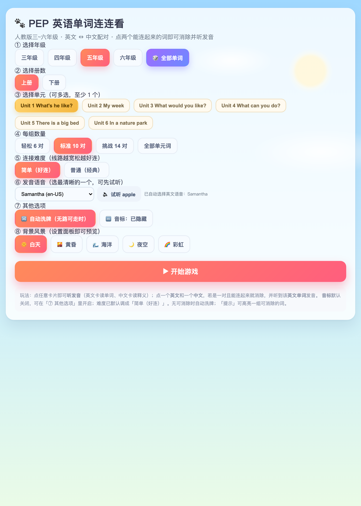
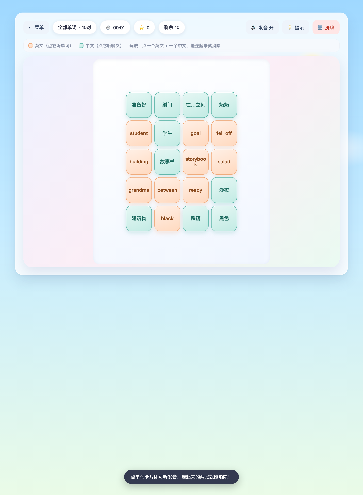

# PEP 小学英语单词连连看

一个**纯前端、零依赖、可离线运行**的网页小游戏，用 PEP 小学英语（三~六年级）词汇做单词连连看，边玩边练听音辨词。

## 📸 截图预览

**菜单 / 设置页** —— 选择年级、册数、单元，调整难度，切换背景风景与发音选项：

**游戏进行中** ——「全部单词」模式，暖桃色英文卡 + 薄荷青色中文卡，白天风景背景：

## ✨ 功能特性

- **全册词库**：覆盖三~六年级共 8 册 / 701 词；另含「🎲 全部单词」不限年级册单元的混合模式。
- **点词即听音**：点英文卡读单词、点中文卡读释义，基于浏览器内置 Web Speech API，**完全离线可玩**。
- **离线音标**：英文卡下方可显示音标（本地音标库 `phonetics.js`，585 条），设置里可一键开关。
- **卡通风景背景**：白天 / 黄昏 / 海洋 / 夜空 四种，设置页实时切换预览。
- **清晰配色**：英文卡暖桃色、中文卡薄荷青色，一眼区分语言，不花哨。
- **难度友好**：连线拐角上限可调，默认「简单好连」；无路可走时自动洗牌；「提示」可高亮一组可消除的词。
- **过关特效**：消除有弹跳、彩屑、飘字与音效，成功读一遍单词。

## 🎮 如何游玩

1. 用浏览器（推荐 Chrome / Edge / Safari 新版）打开 `index.html`。
2. 在设置面板选择**年级、上下册、单元**，或选「🎲 全部单词」混合模式。
3. 点「▶ 开始游戏」。
4. 点一个**英文卡** + 一个**中文卡**，若是一对且能连起来就消除，并听到该单词发音。
5. 全部消除即过关；卡住时点「💡 提示」。

## 📁 文件结构

| 文件 | 说明 |
| --- | --- |
| `index.html` | 游戏主程序（HTML / CSS / JS 内联，单文件可跑） |
| `words.js` | 词库 `window.PEP_WORDS`，按 年级 → 册 → 单元 组织 |
| `phonetics.js` | 离线音标库 `window.PEP_PHON` |
| `PLAN.md` | 实施方案与开发记录 |

## 🛠 技术说明

- **零依赖**：直接双击 `index.html` 即可运行，无需服务器、无需构建。
- **可解性保证**：连连看路径用 BFS 最小拐角剪枝；开局即校验「整盘可清空」，不会出现剩一张消不掉的情况。
- **发音**：优先用浏览器英文嗓音；音标优先读本地库，缺失时联网补齐并缓存到本地。

## 📋 运行要求

- 现代浏览器（Chrome / Edge / Safari 新版）。
- 发音依赖浏览器语音引擎；个别环境英文嗓音需首次联网加载，可在设置页「语音」里切换更清晰的嗓音。

---

> 词库依据 PEP（人教版）小学英语教材整理，供学习练习使用。
